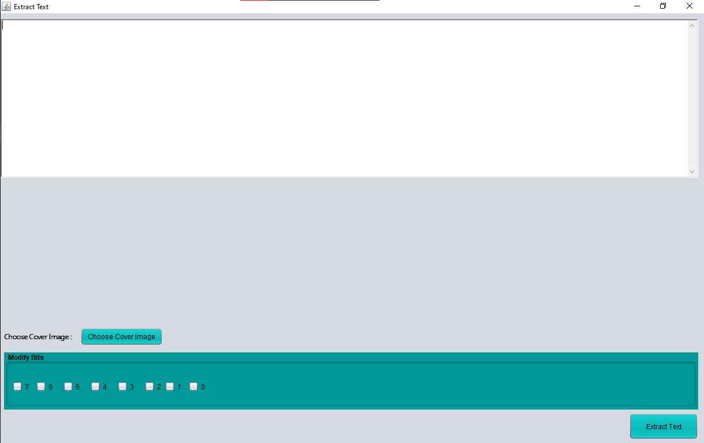

# Image-steganography
This project implements Image Steganography using the Least Significant Bit (LSB) technique. The tool allows users to hide secret messages within images and retrieve them with minimal visual distortion, ensuring the security of sensitive data.
Features
* Embed Secret Data: Hide messages or files within PNG or BMP images.
* Extract Hidden Data: Retrieve concealed messages from stego-images.
* User-Friendly Interface: Simple and intuitive GUI designed with Java Swing.
* Efficient Algorithms: Uses the LSB technique to minimize visual and data distortion.
* #### GUI Screenshots

1. Extract Image: 
2. Hide Image: 
3. Login: 
4. SignUp: 
5. Change Password: 
